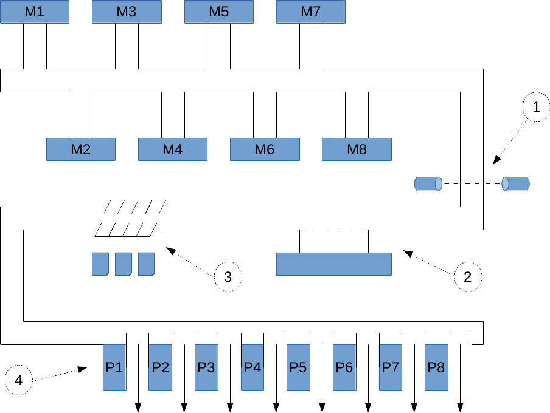
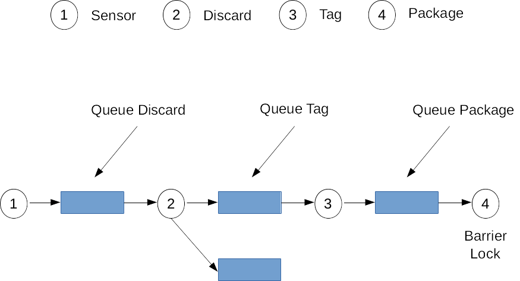

[![Contributors][contributors-shield]][contributors-url]
[![Forks][forks-shield]][forks-url]
[![Stargazers][stars-shield]][stars-url]
[![Issues][issues-shield]][issues-url]
[![MIT License][license-shield]][license-url]
[![LinkedIn][linkedin-shield]][linkedin-url]

   
  

  <h3 align="center">Linha de Produção com Zookeeper</h3>

  

    Produtor-Consumidor com Servidor Zookeeper Aplicado ao Controle de Linha de Produção
     
    

     
  

## Projeto

O projeto realiza o controle de n etapas em linha de produção.
Inicialmente temos m peças fabricadas e dispostas em uma esteira que são identificadas 
através de um sensor ( 1 ), após isso as peças passam pelo controle de qualidade ( 2 ) 
para que aquelas com defeito sejam retiradas da linha de produção. As peças que forem aprovadas 
são então etiquetadas ( 3 ) e encaminhadas para o empacotamento ( 4 ).

   
  

   
  

Cada etapa pode ser vista como um processo separado consumindo uma peça da etapa
anterior e realizando alguma operação na mesma. Se todas as condições forem
satisfeitas esta peça é colocada em uma fila para que a próxima etapa possa consumi-la.

## Implementações

 * Queue
 * Barrier
 * Lock
 * Leader Election

## Dependências

 * Zookeeper 3.6.2

<!-- MARKDOWN LINKS & IMAGES -->

[contributors-shield]: https://img.shields.io/github/contributors/raulduarte/Zookeeper-Production-Line?style=flat-square
[contributors-url]: https://github.com/raulduarte/Zookeeper-Production-Line/graphs/contributors
[forks-shield]: https://img.shields.io/github/forks/raulduarte/Zookeeper-Production-Line?style=flat-square
[forks-url]: https://github.com/raulduarte/Zookeeper-Production-Line/network/members
[stars-shield]: https://img.shields.io/github/stars/raulduarte/Zookeeper-Production-Line?style=flat-square
[stars-url]: https://github.com/raulduarte/Zookeeper-Production-Line/stargazers
[issues-shield]: https://img.shields.io/github/issues/raulduarte/Zookeeper-Production-Line?style=flat-square
[issues-url]: https://github.com/raulduarte/Zookeeper-Production-Line/issues
[license-shield]: https://img.shields.io/github/license/raulduarte/Zookeeper-Production-Line?style=flat-square
[license-url]: https://github.com/raulduarte/Zookeeper-Production-Line/blob/master/LICENSE
[linkedin-shield]: https://img.shields.io/badge/-LinkedIn-black.svg?style=flat-square&logo=linkedin&colorB=555
[linkedin-url]: https://www.linkedin.com/in/raul-duarte/
